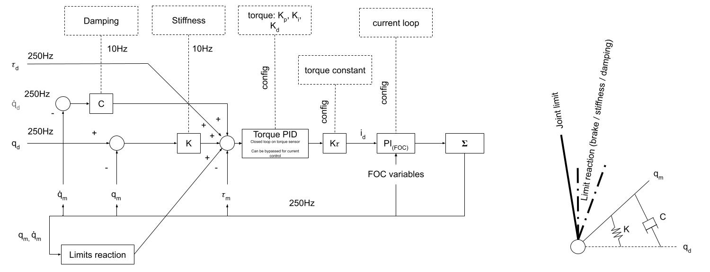

## Demo use of ROS2 hardware interface for Explorer

1. Setup virtual can interface for simulator

```
modprobe vcan
ip link add dev vcan0 type vcan
ip link set mtu 16 up dev vcan0
```

2. Launch Simulator
```
ros2 run pyvesc_explorer app_sim
```

3. Launch Robot controller (and Explorer Comm bridge)
```
ros2 launch explorer_bringup hardware_base.launch.py use_bridge:=true
```

4. Publish some commands
```
ros2 launch explorer_bringup cartesian_control.launch.py
```

Notes:
- Setup should be quite similar for actual robot, just edit the config files.
- Only position interface is supported for now
- The bridge only supports position commands for now.

## Impedance control

This section describes impedance control capabilities and usage

### CAUTION

Impedance control can be dangerous and should be used carefully. Setting wrong stiffness / damping parameters can cause the robot to fall or oscillate.

The parameter "safety_imp_max_q_error" represents basically a tracking error for impedance mode (max difference between setpoint and measured position). It needs to be large enough so the robot can deflect under external forces (as expected in impedance control mode) without triggering an error. However, keeping it as low as possible given the chosen stiffness / damping parameter is  required to ensure safety.

In particular when powered by AC adapter, playing too hard with the robot in impedance mode can reiject current into the AC adapter, causing it to fail and drop power, causing one or more joints to reboot and the robot to fall. Make sure to test your setup with caution (safe environment, emergency stop in hand) and test a bit harder than nominal condition before starting working with impedance mode.

### Overview



This control schme describes the impedance control scheme:

- setpoints (pos, vel (not used yet) and torque) are streamed over CAN
- Stiffness and daping gains are used to compute a target torque that simulates a physical spring and damper between the target angle and the actual angle -> this computes a target torque 
- A PID torque controller closed the loop with torque sensor and outputs current setpoint, ensuring the target torque is followed. This PID can be bypassed to perform torque control based on motor current.
- The current setpoint is computed given the handled by low-level current loop (FOC) to control motor phases mosfets.
- State from the robot is fed back to each controller
- If limits are enabled, limits reaction have an impact only near the end limits and it simulates a physical end stop, preventing the robot to cross the joints limits. it computes an extra component to torque setpoint and can be tuned. 

### Basic usage

1. Bringup the robot in a mode that uses custom_controller, such as:
```
ros2 launch explorer_bringup custom_controller_joint_control.launch.py
```
or
```
ros2 launch explorer_user_interfaces_cpp mode_0_impedance.launch.py
```

2. Deploy the robot (for mode_0 example) in position mode (default mode)

3. Once the robot is deployed and clear from obstacles, you can switch one or more joints to impedance mode:
All joints one by one from 6 to one
```
./scripts/run/impedance/imp_all.sh
```
or
```
./scripts/run/impedance/impN.sh
```

4. You can try the current based control (uses torque estimation and control from motor current, switching off torque sensor)
```
./scripts/run/impedance/bypass_torque_sensor.sh
```

5. You can switch back to position mode when needed

**CAUTION**: the joints might jump back to desired position very fast if current position is far from desired position.

```
./scripts/run/impedance/pos_all.sh
```

### Live update of stiffness / damping

The stiffness and damping parameters are set for each joint at bringup, based on explorer_bringup/config/explorer_custom_controller.yaml configuration

It is possible to live stream stiffness / damping parameters to adapt the impedance behavior from ROS - making it possible to control a cartesian stiffness / damping by updating joint stiffness / damping on the current robot configuration.

Each joint has its own config topic such as for joint 1:
```
name: /explorer_joint_1/config type: orthopus_vesc_interfaces/msg/Config
```

the parameters are sent over CAN to the actuators at 10Hz


### Gravity compensation / torque feed forward

In impedance control mode, effort interface can be used to send torque commands (can be used to peerform gravity compensation). The topic is also exposed

```
ros2 topic pub /explorer_custom_controller/effort/commands std_msgs/msg/Float64MultiArray "{data: [0.0,0.0,0.0,0.0,0.0,0.0]}"
```

gravity compensation node:
```
ros2 run explorer_controllers gravity_compensation_node
```

add payload/external force to gravity compensation:
```
ros2 topic pub --once /explorer_controllers/gravity_compensation/external_wrench geometry_msgs/msg/WrenchStamped "{header: {frame_id: 'tool0'}, wrench: {force: {x: 1.0, y: 2.0, z: -9.81}, torque: {x: 0.1, y: 0.0, z: -0.5}}}"
```

```
ros2 topic pub --once /explorer_controllers/gravity_compensation/external_wrench geometry_msgs/msg/WrenchStamped   "{header: {frame_id: 'tool0'}, wrench: {force: {z: -9.81}}}"
```
